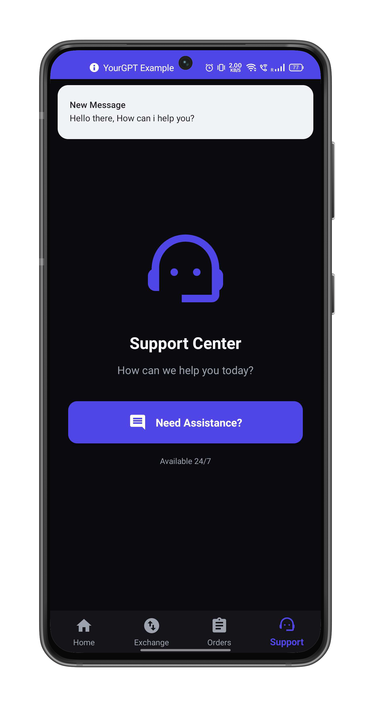
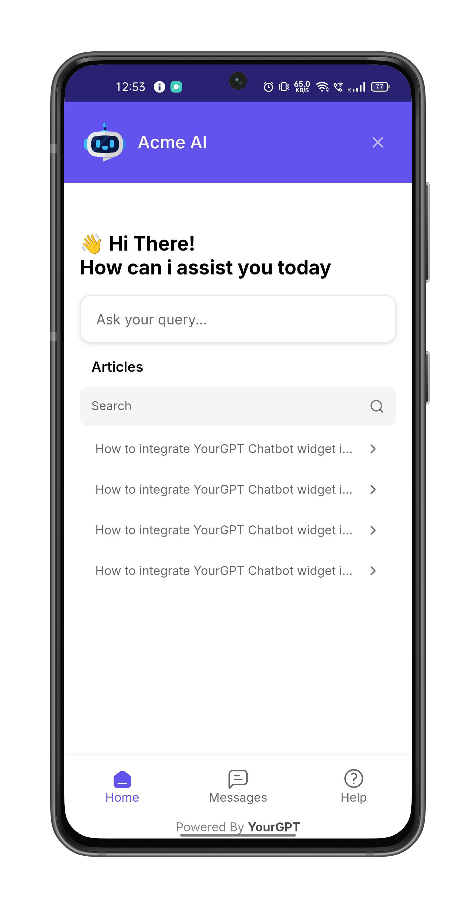
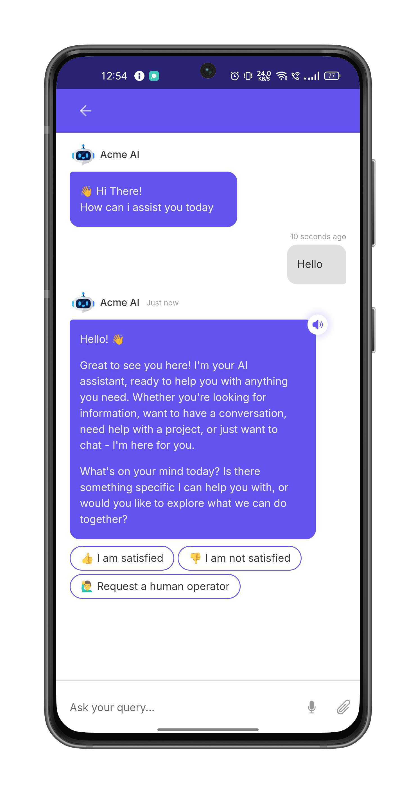

# YourGPT Android SDK

A Kotlin SDK for integrating YourGPT chatbot widget into Android applications.

<p align="center">
  
  
  
</p>

## Quick Start

### Installation

The SDK is distributed via [JitPack](https://jitpack.io/#YourGPT/yourgpt-widget-sdk-android).

**Step 1:** Add the JitPack repository to your `settings.gradle`:

```gradle
dependencyResolutionManagement {
    repositories {
        google()
        mavenCentral()
        maven { url 'https://jitpack.io' }
    }
}
```

> If your project declares repositories in the root `build.gradle` instead, add `maven { url 'https://jitpack.io' }` to the `allprojects { repositories { ... } }` block there.

**Step 2:** Add the dependency to your app's `build.gradle` file:

```gradle
dependencies {
    implementation 'com.github.YourGPT:yourgpt-widget-sdk-android:1.0.0'
    implementation 'androidx.webkit:webkit:1.8.0'
    implementation 'androidx.lifecycle:lifecycle-runtime-ktx:2.7.0'
}
```

### Step 1: Update `AndroidManifest.xml`

Add required permissions:

```xml
<uses-permission android:name="android.permission.INTERNET" />
<uses-permission android:name="android.permission.ACCESS_NETWORK_STATE" />
```

### Step 2: Initialize and Open the Chat Widget

```kotlin
import com.yourgpt.sdk.*
import kotlinx.coroutines.launch

class MainActivity : AppCompatActivity() {

    override fun onCreate(savedInstanceState: Bundle?) {
        super.onCreate(savedInstanceState)
        setContentView(R.layout.activity_main)

        // Initialize SDK
        lifecycleScope.launch {
            YourGPTSDK.initialize(this@MainActivity, YourGPTConfig(widgetUid = "your-widget-uid"))
        }

        // Open chat on button click
        findViewById<View>(R.id.btn_open_chat).setOnClickListener {
            YourGPTSDK.show(this)
        }
    }
}
```

That's it. The SDK handles the WebView, loading states, and lifecycle internally.

### Quick Initialize (One-Liner)

For the simplest setup with notifications auto-enabled:

```kotlin
lifecycleScope.launch {
    YourGPTSDK.quickInitialize(this@MainActivity, "your-widget-uid")
}
```

---

## Configuration

```kotlin
val config = YourGPTConfig(
    widgetUid = "your-widget-uid",    // Required
    debug = true                      // Optional: Enable debug logs (default: false)
)
```

### Push Notifications

Enable push notifications with optional custom icon and sound:

```kotlin
val notifConfig = YourGPTNotificationConfig.builder()
    .setSmallIcon(R.drawable.ic_notification)
    .setSoundUri(Uri.parse("android.resource://${packageName}/raw/notification_sound"))
    .build()

val config = YourGPTConfig(
    widgetUid = "your-widget-uid",
    enableNotifications = true,
    notificationConfig = notifConfig
)

lifecycleScope.launch {
    YourGPTSDK.initialize(this@MainActivity, config)
}
```

See [NOTIFICATION_SETUP.md](NOTIFICATION_SETUP.md) for complete setup instructions.

---

## Opening the Chatbot

### Simple (uses config from `initialize()`)

```kotlin
YourGPTSDK.show(this)
```

### With explicit config

```kotlin
val config = YourGPTConfig(widgetUid = "your-widget-uid")
YourGPTSDK.openChatbotBottomSheet(supportFragmentManager, config)
```

### Open a specific conversation

```kotlin
YourGPTSDK.openSession(this, sessionUid = "conversation-uid")
```

### Create a standalone Fragment

Use `createChatbotFragment()` when you want to embed the chatbot in your own container instead of a bottom sheet:

```kotlin
val fragment = YourGPTSDK.createChatbotFragment(
    widgetUid = "your-widget-uid",
    customParams = mapOf("lang" to "en")
)

// Use with your own FragmentTransaction
supportFragmentManager.beginTransaction()
    .replace(R.id.container, fragment)
    .commit()
```

---

## Widget Data Methods

After the chatbot is opened, you can send data to the widget:

```kotlin
val fragment = YourGPTSDK.createChatbotFragment(widgetUid = "your-widget-uid")

// Send session-specific data
fragment.setSessionData(mapOf("orderId" to "12345", "plan" to "premium"))

// Send visitor data (auto-enriched with device info: platform, model, OS version, app version)
fragment.setVisitorData(mapOf("userId" to "user_abc", "name" to "John"))

// Send contact information
fragment.setContactData(mapOf("email" to "john@example.com", "phone" to "+1234567890"))

// Programmatically open the chat interface
fragment.openChat()
```

---

## Event Handling

### Global Event Listener

Implement `YourGPTEventListener` to receive SDK-wide events:

```kotlin
class MainActivity : AppCompatActivity(), YourGPTEventListener {

    override fun onCreate(savedInstanceState: Bundle?) {
        super.onCreate(savedInstanceState)
        YourGPTSDK.setEventListener(this)
    }

    // Required — widget events
    override fun onMessageReceived(message: Map<String, Any>) { }
    override fun onChatOpened() { }
    override fun onChatClosed() { }
    override fun onError(error: String) { }
    override fun onLoadingStarted() { }
    override fun onLoadingFinished() { }

    // Optional — notification events (default no-op)
    override fun onFCMTokenReceived(token: String) { }
    override fun onPushMessageReceived(data: Map<String, Any>) { }
    override fun onNotificationClicked(extras: Map<String, String>) { }
    override fun onWidgetOpenRequested(widgetUid: String) { }
    override fun onNotificationPermissionGranted() { }
    override fun onNotificationPermissionDenied() { }
}
```

### Per-Dialog Listener

Use `ChatbotDialogListener` for per-instance event handling:

```kotlin
val fragment = YourGPTSDK.createChatbotFragment(widgetUid = "your-widget-uid")
fragment.dialogListener = object : ChatbotDialogListener {
    override fun chatbotDidReceiveMessage(message: Map<String, Any>) { }
    override fun chatbotDidOpen() { }
    override fun chatbotDidClose() { }
    override fun chatbotDidFailWithError(error: String) { }
    override fun chatbotDidStartLoading() { }
    override fun chatbotDidFinishLoading() { }
}
```

---

## Custom Loading & Error Views

Inject custom views for the loading and error states:

```kotlin
val fragment = YourGPTSDK.createChatbotFragment(widgetUid = "your-widget-uid")

// Custom loading view
fragment.customLoadingViewProvider = { context ->
    LayoutInflater.from(context).inflate(R.layout.my_loading_view, null)
}

// Custom error view (receives the error message)
fragment.customErrorViewProvider = { context, errorMessage ->
    LayoutInflater.from(context).inflate(R.layout.my_error_view, null).apply {
        findViewById<TextView>(R.id.error_text).text = errorMessage
    }
}

fragment.show(supportFragmentManager, "ChatbotBottomSheet")
```

The default error view includes a "Try Again" button that retries the connection automatically.

---

## SDK State

### Observe State Changes

```kotlin
lifecycleScope.launch {
    YourGPTSDK.stateFlow.collect { state ->
        when (state.connectionState) {
            YourGPTConnectionState.CONNECTED -> { /* Ready */ }
            YourGPTConnectionState.CONNECTING -> { /* Loading */ }
            YourGPTConnectionState.ERROR -> { /* Error: state.error */ }
            YourGPTConnectionState.DISCONNECTED -> { /* Disconnected */ }
        }
    }
}
```

### Check Readiness

```kotlin
if (YourGPTSDK.isReady) {
    // SDK is connected and ready
}
```

---

## Error Handling

The SDK uses structured error types via the `YourGPTError` sealed class:

```kotlin
lifecycleScope.launch {
    try {
        YourGPTSDK.initialize(this@MainActivity, config)
    } catch (e: YourGPTError.InvalidConfiguration) {
        // Invalid or missing configuration
    } catch (e: YourGPTError.NotInitialized) {
        // SDK not initialized — call initialize() first
    } catch (e: YourGPTError.NotReady) {
        // SDK not ready (still loading or in error state)
    } catch (e: YourGPTError) {
        // Other SDK errors (InvalidURL, WebViewError)
    }
}
```

| Error Type | Description |
|------------|-------------|
| `YourGPTError.InvalidConfiguration` | Configuration is invalid or missing required fields |
| `YourGPTError.NotInitialized` | SDK has not been initialized |
| `YourGPTError.NotReady` | SDK is not ready (still loading or in error state) |
| `YourGPTError.InvalidURL` | Failed to build a valid widget URL |
| `YourGPTError.WebViewError` | An error occurred in the WebView |

---

## Requirements

- Android API level 21 (Android 5.0) or higher
- Kotlin 1.8.0 or higher
- AndroidX libraries

## ProGuard/R8

If you're using code obfuscation, add these rules to your `proguard-rules.pro`:

```proguard
-keep class com.yourgpt.sdk.** { *; }
-keepclassmembers class * {
    @android.webkit.JavascriptInterface <methods>;
}
```
